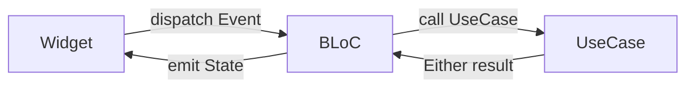

# Clean Architecture

## What is Clean Architecture?

Clean Architecture is a software design philosophy by Robert C. Martin ("Uncle Bob") that organizes code into concentric layers, where **dependencies only point inward** — outer layers depend on inner layers, never the reverse.

```
┌──────────────────────────────────────┐
│         Presentation (Flutter)       │
│  ┌────────────────────────────────┐  │
│  │       Domain (Pure Dart)       │  │
│  │  ┌──────────────────────────┐  │  │
│  │  │   Data (Hive/Adapters)   │  │  │
│  │  └──────────────────────────┘  │  │
│  └────────────────────────────────┘  │
└──────────────────────────────────────┘

Dependencies: Presentation → Domain ← Data
```

The **Domain** layer is at the center and has no dependencies on Flutter, Hive, or any external library. It is pure Dart business logic.

## How Paisa Implements Clean Architecture

### Domain Layer — The Heart of the App

Every feature has a `domain/` directory containing:

#### 1. Entities

Pure Dart classes representing business objects. These do **not** have Hive annotations or JSON serializers:

```dart
// lib/features/transaction/domain/entities/transaction.dart
class Transaction extends Equatable {
  final int? superId;
  final String name;
  final double currency;
  final int accountId;
  final int categoryId;
  final DateTime time;
  final TransactionType type;
  final String? description;

  const Transaction({...});
}
```

#### 2. Repository Interfaces

Abstract contracts that the Data layer must implement. The Domain layer never imports Hive or any data package:

```dart
// lib/features/transaction/domain/repository/transaction_repository.dart
abstract class TransactionRepository {
  Future<Either<AppError, void>> addTransaction(Transaction transaction);
  Future<Either<AppError, void>> deleteTransaction(int transactionId);
  Future<Either<AppError, List<Transaction>>> transactions();
  Future<Either<AppError, Transaction>> fetchTransactionFromId(int transactionId);
  Future<Either<AppError, void>> updateTransaction(Transaction transaction);
}
```

#### 3. Use Cases

Single-responsibility classes that encapsulate one business operation. Each takes a params object and returns an `Either<AppError, T>` (from the `dartz` library):

```dart
// lib/features/transaction/domain/use_case/add_transaction_use_case.dart
@injectable
class AddTransactionUseCase implements UseCase<void, AddTransactionParams> {
  final TransactionRepository transactionRepository;
  AddTransactionUseCase({required this.transactionRepository});

  @override
  Future<Either<AppError, void>> call(AddTransactionParams params) {
    return transactionRepository.addTransaction(params.transaction);
  }
}
```

### Data Layer — Storage Implementation

Each feature's `data/` directory contains:

#### 1. Models

Hive-annotated classes that map to storage. They extend or convert to/from Domain Entities:

```dart
// lib/features/transaction/data/model/transaction_model.dart
@HiveType(typeId: 3)
class TransactionModel extends HiveObject {
  @HiveField(0)
  late String name;

  @HiveField(1)
  late double currency;

  @HiveField(2)
  late int accountId;

  @HiveField(3)
  late int categoryId;

  @HiveField(4)
  late DateTime time;

  @HiveField(5)
  late TransactionType type;
}
```

#### 2. Data Sources

Classes that directly read from and write to Hive boxes:

```dart
@injectable
class LocalTransactionDataSource {
  final Box<TransactionModel> transactionBox;

  LocalTransactionDataSource({required this.transactionBox});

  Future<void> addTransaction(TransactionModel model) async {
    await transactionBox.add(model);
  }

  List<TransactionModel> transactions() {
    return transactionBox.values.toList();
  }
}
```

#### 3. Repository Implementations

Bridge between the Data and Domain layers. Convert models ↔ entities and implement the Domain's repository interface:

```dart
@Injectable(as: TransactionRepository)
class TransactionRepositoryImpl implements TransactionRepository {
  final LocalTransactionDataSource dataSource;

  @override
  Future<Either<AppError, void>> addTransaction(Transaction transaction) async {
    try {
      final model = TransactionModel()
        ..name = transaction.name
        ..currency = transaction.currency
        ..accountId = transaction.accountId
        ..categoryId = transaction.categoryId
        ..time = transaction.time
        ..type = transaction.type;
      await dataSource.addTransaction(model);
      return Right(unit);
    } catch (e) {
      return Left(AppError(message: e.toString()));
    }
  }
}
```

### Presentation Layer — UI & State

#### BLoC Pattern

Each feature has a BLoC (or Cubit) that bridges UI and Domain:



**Events** are user intentions:
```dart
abstract class TransactionEvent {}
class AddTransactionEvent extends TransactionEvent {
  final Transaction transaction;
}
```

**States** are what the UI renders:
```dart
@freezed
class TransactionState with _$TransactionState {
  const factory TransactionState.initial() = TransactionInitial;
  const factory TransactionState.loading() = TransactionLoading;
  const factory TransactionState.added() = TransactionAdded;
  const factory TransactionState.error(String message) = TransactionError;
}
```

## Benefits of This Architecture in Paisa

| Benefit | How it shows up |
|---------|----------------|
| Testable business logic | Use Cases have no Flutter dependency |
| Swappable storage | Replace Hive with SQLite by implementing the same interface |
| Predictable state | BLoC enforces unidirectional data flow |
| Feature isolation | Each module is self-contained |
| Code generation | `@injectable` removes DI boilerplate |
| Type-safe errors | `Either<AppError, T>` forces error handling |
