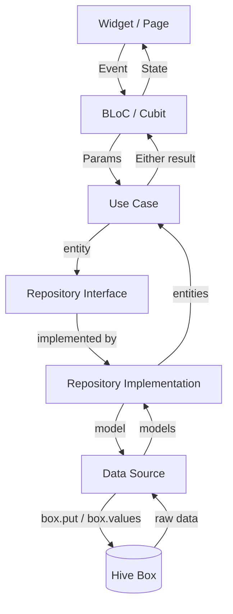

# Data Layer & Models

## Storage Engine: Hive

Paisa uses **Hive**, a lightweight, fast, pure-Dart NoSQL key-value store. Data is stored in typed "boxes" (similar to tables), each holding instances of a Hive model class.

### Why Hive?

- Zero-config setup — no native code or migrations
- Strongly typed with generated adapters
- Reactive — boxes expose a `ValueListenable` for widget rebuilds
- Fast reads (all data loaded into memory)
- Works identically on all platforms

## Hive Box Registry

Each data type lives in its own named box, registered via `BoxType` enum:

| Box Name | Type | Hive Type ID | Stores |
|----------|------|-------------|--------|
| `expense` | `TransactionModel` | 3 | All financial transactions |
| `accounts` | `AccountModel` | 0 | Bank accounts and wallets |
| `category` | `CategoryModel` | 1 | Transaction categories |
| `debts` | `DebitModel` | 5 | Debt/loan entries |
| `transactions` | `DebitTransactionsModel` | 6 | Payments against debts |
| `recurring` | `RecurringModel` | 8 | Recurring transaction schedules |
| `settings` | `dynamic` | — | All app settings (key-value) |

## Data Models

### TransactionModel

Represents a single financial transaction (expense, income, or transfer).

```dart
@HiveType(typeId: 3)
class TransactionModel extends HiveObject {
  @HiveField(0) late String name;          // Transaction label
  @HiveField(1) late double currency;      // Amount
  @HiveField(2) late int accountId;        // Linked account (Hive key)
  @HiveField(3) late int categoryId;       // Linked category (Hive key)
  @HiveField(4) late DateTime time;        // Transaction datetime
  @HiveField(5) late TransactionType type; // expense | income | transfer
  @HiveField(6) String? description;       // Optional notes
  @HiveField(7) int? superId;             // Target account for transfers
}
```

**Relationships:**
- `accountId` → `AccountModel.key`
- `categoryId` → `CategoryModel.key`
- `superId` → `AccountModel.key` (only for `TransactionType.transfer`)

### AccountModel

Represents a bank account, wallet, or cash source.

```dart
@HiveType(typeId: 0)
class AccountModel extends HiveObject {
  @HiveField(0) late String name;            // Account display name
  @HiveField(1) late double amount;          // Current/initial balance
  @HiveField(2) late int color;              // ARGB color int
  @HiveField(3) late String bankName;        // Bank or institution name
  @HiveField(4) late CardType cardType;      // bank | wallet | transit | etc.
  @HiveField(5) late bool isAccountExcluded; // Exclude from total balance
}
```

### CategoryModel

Represents a transaction category (Food, Transport, Salary, etc.).

```dart
@HiveType(typeId: 1)
class CategoryModel extends HiveObject {
  @HiveField(0) late String name;         // Category label
  @HiveField(1) late int icon;            // MDI icon codepoint
  @HiveField(2) late int color;           // ARGB color int
  @HiveField(3) late bool isDefault;      // Pre-loaded default category
  @HiveField(4) double? budget;           // Optional monthly budget limit
  @HiveField(5) bool? isBudget;           // Budget tracking enabled
  @HiveField(6) String? description;      // Optional description
}
```

### DebitModel

Represents a debt or loan entry.

```dart
@HiveType(typeId: 5)
class DebitModel extends HiveObject {
  @HiveField(0) late String name;               // Who/what this debt is with
  @HiveField(1) late double amount;             // Total debt amount
  @HiveField(2) late DateTime dateTime;         // Date created
  @HiveField(3) late DateTime expiryDateTime;   // Due/expiry date
  @HiveField(4) late DebtType debtType;         // debit | credit
  @HiveField(5) String? description;            // Optional notes
}
```

### DebitTransactionsModel

Tracks individual payments made against a debt.

```dart
@HiveType(typeId: 6)
class DebitTransactionsModel extends HiveObject {
  @HiveField(0) late double amount;    // Payment amount
  @HiveField(1) late DateTime dateTime; // Payment date
  @HiveField(2) late int parentId;     // Foreign key → DebitModel.key
}
```

### RecurringModel

Defines a scheduled recurring transaction.

```dart
@HiveType(typeId: 8)
class RecurringModel extends HiveObject {
  @HiveField(0) late String name;                     // Label
  @HiveField(1) late double amount;                   // Amount each occurrence
  @HiveField(2) late RecurringType recurringType;     // daily | weekly | monthly | yearly
  @HiveField(3) late DateTime recurringDate;          // Next scheduled date
  @HiveField(4) late int accountId;                   // Source account
  @HiveField(5) late int categoryId;                  // Category
  @HiveField(6) late TransactionType transactionType; // expense | income
}
```

## Settings Box Schema

The `settings` box stores raw key-value pairs. Key constants are defined in `lib/core/constants/constants.dart`:

| Key | Type | Default | Purpose |
|-----|------|---------|---------|
| `userIntroFinishedKey` | `bool` | `false` | Whether intro is completed |
| `userNameSetKey` | `String` | `''` | User's display name |
| `userImageKey` | `String` | `''` | Profile image path |
| `userCategorySelectorKey` | `bool` | `true` | Default category setup done |
| `userAccountSelectorKey` | `bool` | `true` | Default account setup done |
| `userCountryKey` | `Map` | `null` | Selected country/currency JSON |
| `userAuthKey` | `bool` | `false` | Biometric auth enabled |
| `appColorKey` | `int` | purple | Primary theme seed color |
| `themeModeKey` | `int` | system | 0=system, 1=light, 2=dark |
| `dynamicThemeKey` | `bool` | `false` | Material You dynamic colors |
| `blackThemeKey` | `bool` | `false` | Pure black dark mode |
| `appFontChangerKey` | `String` | `'Outfit'` | Selected font family name |
| `appLanguageKey` | `String` | `'en'` | App locale code |

## Data Flow Diagram



## Export & Import Data Format

### JSON Export Structure

```json
{
  "version": "6.0.8",
  "created_at": "2024-01-15T10:30:00",
  "accounts": [
    { "name": "Savings", "bankName": "HDFC", "amount": 50000.0, "color": -14575885, "cardType": 0 }
  ],
  "categories": [
    { "name": "Food", "icon": 983237, "color": -43230, "isDefault": true, "isBudget": false }
  ],
  "transactions": [
    { "name": "Lunch", "currency": 250.0, "accountId": 0, "categoryId": 1, "time": "2024-01-15", "type": 0 }
  ],
  "debts": [],
  "debtTransactions": [],
  "recurring": []
}
```

### CSV Export Columns

```
Date, Name, Amount, Account, Category, Type, Description
2024-01-15, Lunch, 250.00, Savings, Food, Expense, Restaurant
```
