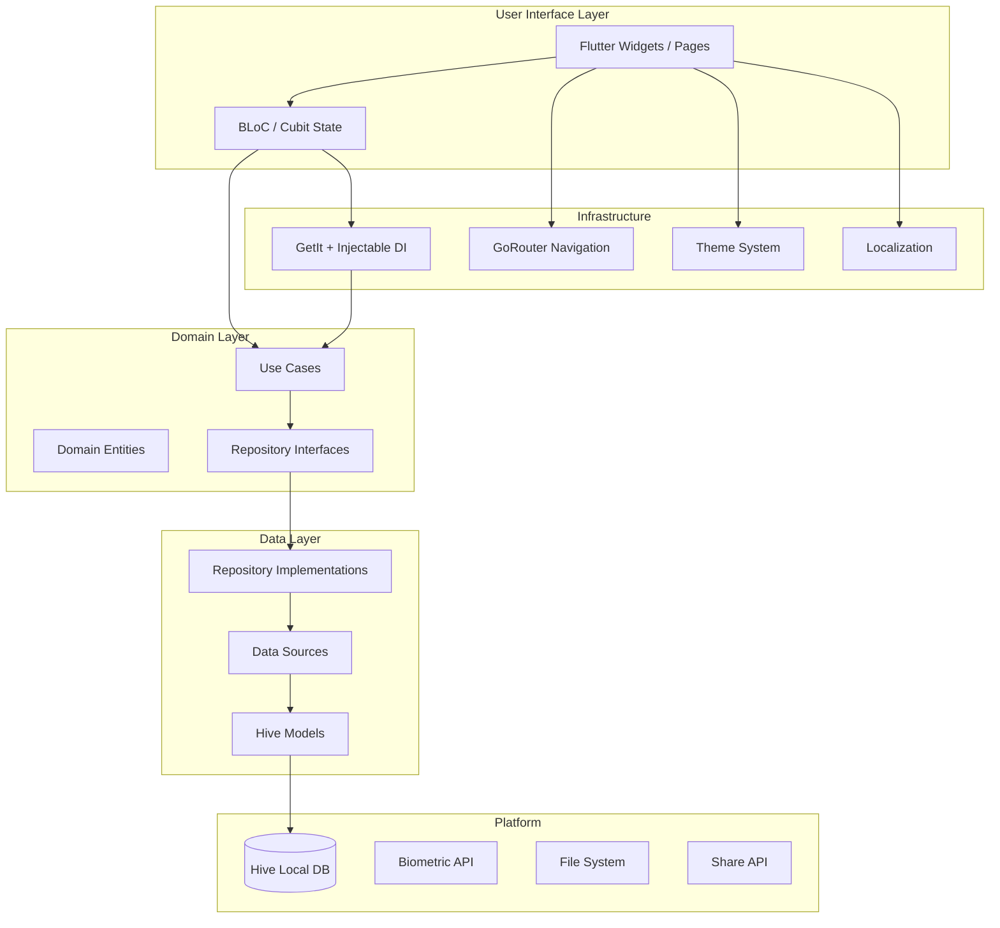
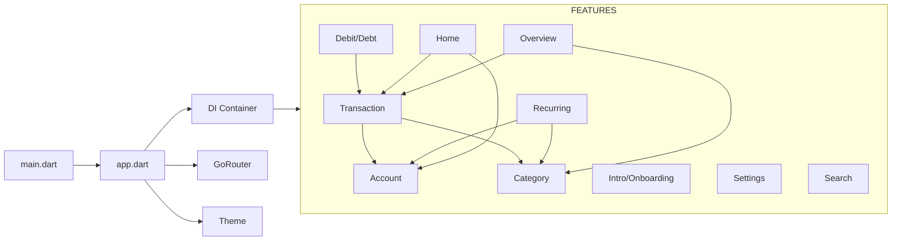
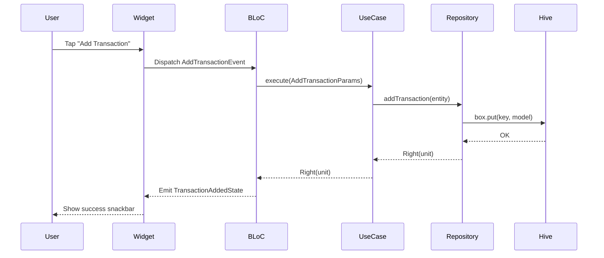

# Architecture Overview

## High-Level System Diagram



## Architectural Principles

Paisa follows **Clean Architecture** principles as described by Robert C. Martin, adapted for Flutter:

1. **Dependency Rule**: Inner layers never depend on outer layers. Domain knows nothing about Hive, Flutter, or BLoC.
2. **Feature Isolation**: Each feature module (`transaction`, `account`, `category`, etc.) is self-contained.
3. **Testability**: Business logic in Use Cases can be tested without Flutter or Hive.
4. **Separation of Concerns**: UI, business rules, and data access are in distinct layers.

## Layer Responsibilities

```
Presentation  →  What the user sees and interacts with
Domain        →  The business rules (framework-independent)
Data          →  How data is stored and retrieved
```

### Presentation Layer
- Flutter widgets and pages
- BLoC/Cubit state management
- Handles user events, displays state

### Domain Layer
- Use Cases — one business operation per class
- Entity models — pure Dart classes, no Flutter dependency
- Repository interfaces — contracts the Data layer must fulfill

### Data Layer
- Repository implementations
- Hive data sources
- Model classes with Hive type adapters and JSON serializers

## Feature Module Structure

Every feature follows the same directory layout:

```
lib/features/<feature_name>/
├── presentation/
│   ├── bloc/              # BLoC: events, states, bloc class
│   ├── cubit/             # Cubits for simpler state
│   ├── pages/             # Full-screen pages
│   ├── widgets/           # Reusable sub-widgets
│   └── controller/        # Presentation controllers
├── data/
│   ├── model/             # Hive models (serializable)
│   ├── data_sources/      # Hive data access
│   └── repository/        # Repository implementation
└── domain/
    ├── entities/          # Business objects (pure Dart)
    ├── repository/        # Abstract repository interface
    └── use_case/          # Business logic use cases
```

## Module Dependency Map



## Key Singletons & Services

| Service | Registration | Scope |
|---------|-------------|-------|
| `GoRouter` | Global `goRouter` variable | Singleton |
| Hive Boxes | `HiveModule` in DI | Singleton per box type |
| All BLoCs/Cubits | `@injectable` | Factory (new instance per use) |
| `AuthenticationRepository` | `@singleton` | Singleton |
| All `UseCase` classes | `@injectable` | Factory |

## Reactive State Flow


