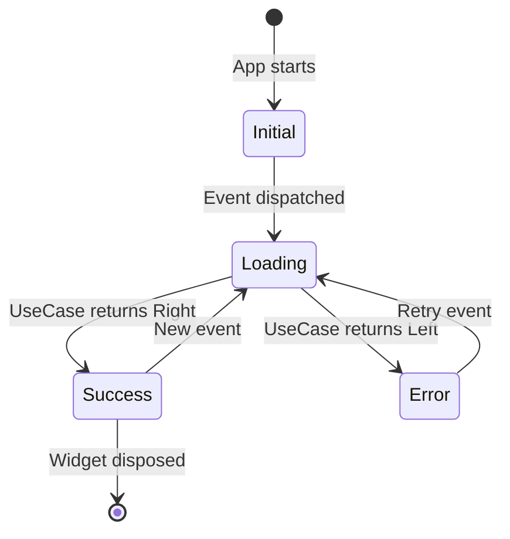

# State Management

## Overview

Paisa uses the **BLoC (Business Logic Component)** pattern via the `flutter_bloc` package. BLoC enforces a strict unidirectional data flow:

```
User Action → Event → BLoC → State → UI Update
```

Both full **BLoCs** (event-based) and **Cubits** (method-based, simpler) are used, depending on the complexity of the feature.

## BLoC vs Cubit Decision Guide

| Use BLoC when... | Use Cubit when... |
|-----------------|------------------|
| Multiple distinct event types | Simple state transitions |
| Complex event → state logic | Method-call driven changes |
| Need event history for debugging | State is simpler |
| Different events produce different states | Example: settings toggle |

## All BLoCs and Cubits in the App

| Class | Type | Feature | Responsibilities |
|-------|------|---------|-----------------|
| `TransactionBloc` | BLoC | Transaction | Add, edit, delete, fetch transactions |
| `AccountBloc` | BLoC | Account | Add, edit, delete, fetch accounts |
| `CategoryBloc` | BLoC | Category | Add, edit, delete, fetch categories |
| `DebtsCubit` | Cubit | Debit/Debt | Debt CRUD, payment tracking |
| `RecurringCubit` | Cubit | Recurring | Schedule & run recurring transactions |
| `SettingCubit` | Cubit | Settings | Theme, language, biometric, font changes |
| `HomeCubit` | Cubit | Home | Home tab navigation state |
| `SearchCubit` | Cubit | Search | Query and filter transactions |
| `CountryPickerCubit` | Cubit | Intro | Country list, selection, persistence |
| `ProfileCubit` | Cubit | Profile | User name and image management |

## State Lifecycle



## BLoC Pattern — Full Example (Transaction)

### 1. Events

```dart
// lib/features/transaction/presentation/bloc/transaction_event.dart
abstract class TransactionEvent extends Equatable {}

class FetchTransactionFromIdEvent extends TransactionEvent {
  final int transactionId;
  FetchTransactionFromIdEvent(this.transactionId);
  @override List<Object> get props => [transactionId];
}

class AddOrUpdateTransactionEvent extends TransactionEvent {
  final String name;
  final double amount;
  final int accountId;
  final int categoryId;
  final DateTime dateTime;
  final TransactionType transactionType;
  final String? description;
  final int? transactionId;
  // ...constructor
}

class DeleteTransactionEvent extends TransactionEvent {
  final int transactionId;
  DeleteTransactionEvent(this.transactionId);
  @override List<Object> get props => [transactionId];
}
```

### 2. States

```dart
// lib/features/transaction/presentation/bloc/transaction_state.dart
@freezed
class TransactionState with _$TransactionState {
  const factory TransactionState.initial() = TransactionInitial;
  const factory TransactionState.loading() = TransactionLoading;
  const factory TransactionState.updateTransaction(Transaction transaction) = UpdateTransactionState;
  const factory TransactionState.added() = TransactionAdded;
  const factory TransactionState.deleted() = TransactionDeleted;
  const factory TransactionState.error(String message) = TransactionErrorState;
}
```

### 3. BLoC

```dart
// lib/features/transaction/presentation/bloc/transaction_bloc.dart
@injectable
class TransactionBloc extends Bloc<TransactionEvent, TransactionState> {
  final AddTransactionUseCase addTransactionUseCase;
  final DeleteTransactionUseCase deleteTransactionUseCase;
  final GetTransactionByIdUseCase getTransactionByIdUseCase;
  final UpdateTransactionUseCase updateTransactionUseCase;

  TransactionBloc({
    required this.addTransactionUseCase,
    required this.deleteTransactionUseCase,
    required this.getTransactionByIdUseCase,
    required this.updateTransactionUseCase,
  }) : super(const TransactionState.initial()) {
    on<FetchTransactionFromIdEvent>(_fetchTransactionById);
    on<AddOrUpdateTransactionEvent>(_addOrUpdateTransaction);
    on<DeleteTransactionEvent>(_deleteTransaction);
  }

  Future<void> _addOrUpdateTransaction(
    AddOrUpdateTransactionEvent event,
    Emitter<TransactionState> emit,
  ) async {
    emit(const TransactionState.loading());
    final result = await addTransactionUseCase(AddTransactionParams(
      transaction: Transaction(
        name: event.name,
        currency: event.amount,
        accountId: event.accountId,
        // ...
      ),
    ));
    result.fold(
      (error) => emit(TransactionState.error(error.message)),
      (_) => emit(const TransactionState.added()),
    );
  }
}
```

### 4. Widget Usage

```dart
// In TransactionPage widget
BlocProvider(
  create: (context) => getIt<TransactionBloc>(),
  child: BlocConsumer<TransactionBloc, TransactionState>(
    listener: (context, state) {
      state.mapOrNull(
        added: (_) => context.pop(),               // Navigate back on success
        error: (s) => showErrorSnackBar(s.message), // Show error
      );
    },
    builder: (context, state) {
      return state.maybeMap(
        loading: (_) => const CircularProgressIndicator(),
        orElse: () => TransactionForm(),
      );
    },
  ),
);
```

## Cubit Pattern — Example (Settings)

```dart
@injectable
class SettingCubit extends Cubit<SettingState> {
  final Box<dynamic> settingsBox;

  SettingCubit({required this.settingsBox})
      : super(const SettingState.initial());

  void updateThemeMode(ThemeMode themeMode) {
    settingsBox.put(themeModeKey, themeMode.index);
    emit(SettingState.themeMode(themeMode));
  }

  void toggleBiometric(bool enabled) {
    settingsBox.put(userAuthKey, enabled);
    emit(SettingState.biometric(enabled));
  }
}
```

## Reactive Navigation with BLoC

The GoRouter is connected to the Hive settings box via `refreshListenable`. When settings like `userIntroFinishedKey` change, the router re-evaluates its `redirect` function and automatically navigates to the correct screen:

```dart
final GoRouter goRouter = GoRouter(
  refreshListenable: settings.listenable(keys: [
    userIntroFinishedKey,
    userNameSetKey,
    userCountryKey,
    userAuthKey,
    // ...
  ]),
  redirect: (context, state) {
    // Redirect based on settings state
    if (!isIntroDone) return '/intro';
    if (name.isEmpty) return '/onboarding';
    if (isBiometricEnabled) return '/biometric';
    return '/landing';
  },
);
```

## Provider Usage

`provider` is used in a limited way alongside BLoC for sharing the `SummaryController` (a presentation-level controller that aggregates data for the home page) down the widget tree without needing a BLoC.
