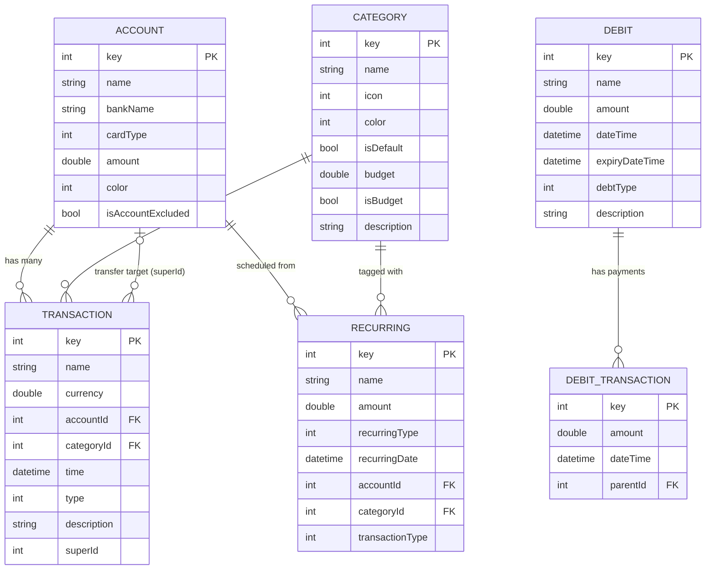

# Data Models Reference

This page documents all data models in Paisa and their relationships.

## Entity Relationship Diagram



## Enum Types

### TransactionType

```dart
enum TransactionType {
  expense,   // 0 — Money going out
  income,    // 1 — Money coming in
  transfer,  // 2 — Money moving between accounts
}
```

### CardType

```dart
enum CardType {
  bank,     // 0 — Bank account
  wallet,   // 1 — Digital wallet
  transit,  // 2 — Transit/travel card
  credit,   // 3 — Credit card
  cash,     // 4 — Physical cash
}
```

### DebtType

```dart
enum DebtType {
  debit,  // 0 — Money you owe (borrowed)
  credit, // 1 — Money owed to you (lent)
}
```

### RecurringType

```dart
enum RecurringType {
  daily,   // 0 — Every day
  weekly,  // 1 — Every 7 days
  monthly, // 2 — Every month, same date
  yearly,  // 3 — Every year, same date
}
```

### FilterType

```dart
enum FilterType {
  daily,   // Single day view
  weekly,  // 7-day rolling window
  monthly, // Calendar month
  yearly,  // Calendar year
}
```

### BoxType

Used to name Hive boxes:

```dart
enum BoxType {
  expense,      // → "expense"      TransactionModel
  accounts,     // → "accounts"     AccountModel
  category,     // → "category"     CategoryModel
  debts,        // → "debts"        DebitModel
  transactions, // → "transactions" DebitTransactionsModel
  recurring,    // → "recurring"    RecurringModel
  settings,     // → "settings"     dynamic
}
```

## Hive Type IDs

Each `@HiveType` class has a unique integer ID. Never reuse or change these:

| TypeId | Class |
|--------|-------|
| 0 | `AccountModel` |
| 1 | `CategoryModel` |
| 2 | `TransactionType` (enum adapter) |
| 3 | `TransactionModel` |
| 4 | `CardType` (enum adapter) |
| 5 | `DebitModel` |
| 6 | `DebitTransactionsModel` |
| 7 | `DebtType` (enum adapter) |
| 8 | `RecurringModel` |
| 9 | `RecurringType` (enum adapter) |

::: danger Do not change TypeIds
If you change a Hive TypeId on an existing model, existing data in the user's storage will become unreadable (Hive stores the TypeId in the binary format).
:::
