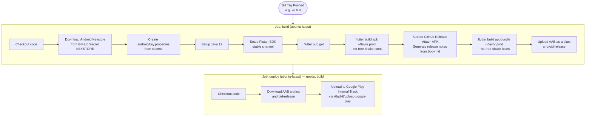

# CI/CD Pipeline

## Overview

The project uses **GitHub Actions** for continuous delivery. The pipeline is triggered on every **git tag push** and automates the full Android release process: build → GitHub Release → Google Play Store.

**Workflow file:** `.github/workflows/deplay_android_build.yml`

## Pipeline Diagram



## Trigger

The workflow runs on:
- **Git tag push**: Any tag (`*`)
- **Manual trigger**: `workflow_dispatch` button in GitHub Actions UI

```yaml
on:
  push:
    tags:
      - "*"
  workflow_dispatch:
```

## Required GitHub Secrets

Set these in **GitHub → Settings → Secrets → Actions**:

| Secret Name | Description |
|------------|-------------|
| `KEYSTORE` | Base64-encoded Android keystore `.jks` file |
| `SIGNING_STORE_PASSWORD` | Keystore store password |
| `SIGNING_KEY_PASSWORD` | Key password |
| `SIGNING_KEY_ALIAS` | Key alias |
| `SERVICE_ACCOUNT_JSON` | Google Play service account JSON (for Play Store upload) |
| `GITHUB_TOKEN` | Automatically provided by GitHub Actions |

## Encoding the Keystore

```bash
# Encode keystore to base64
base64 -i upload-keystore.jks | pbcopy   # macOS (copies to clipboard)
base64 -i upload-keystore.jks            # Linux (prints to stdout)
```

Paste the output as the `KEYSTORE` secret.

## Creating a Release

To trigger the CI/CD pipeline:

```bash
# Tag the commit
git tag v6.0.9

# Push the tag
git push origin v6.0.9
```

The pipeline will:
1. Build a signed APK
2. Create a GitHub Release with the APK attached
3. Build a signed AAB
4. Upload the AAB to Google Play's internal testing track

## Google Play Service Account Setup

1. In [Google Play Console](https://play.google.com/console): Setup → API access
2. Link to a Google Cloud project
3. Create a service account with "Release manager" role
4. Download the service account JSON
5. Paste the entire JSON as the `SERVICE_ACCOUNT_JSON` secret

## Release Notes

The GitHub Release body is populated from `body.md` at the repo root:

```yaml
- name: Create GitHub Release
  uses: ncipollo/release-action@v1
  with:
    artifacts: build/app/outputs/flutter-apk/app-prod-release.apk
    bodyFile: "body.md"
    generateReleaseNotes: true
    makeLatest: true
```

Update `body.md` before tagging to include the changelog for that release.

## Build Artifacts

| Artifact | Path | Used For |
|----------|------|---------|
| Signed APK | `build/app/outputs/flutter-apk/app-prod-release.apk` | GitHub Release, sideloading |
| Signed AAB | `build/app/outputs/bundle/prodRelease/app-prod-release.aab` | Google Play Store |

## Adding Web Deployment (Optional)

To also deploy the web app on every release, add a third job:

```yaml
deploy-web:
  name: Deploy Web
  runs-on: ubuntu-latest
  steps:
    - uses: actions/checkout@v4
    - uses: subosito/flutter-action@v2
      with:
        channel: stable
    - run: flutter pub get
    - run: flutter pub run build_runner build --delete-conflicting-outputs
    - run: flutter build web --release
    - name: Deploy to GitHub Pages
      uses: peaceiris/actions-gh-pages@v3
      with:
        github_token: ${{ secrets.GITHUB_TOKEN }}
        publish_dir: ./build/web
```
