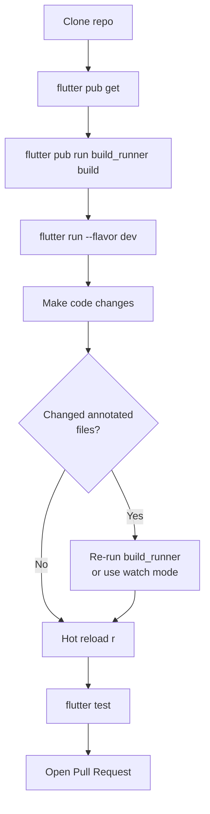

# Local Development Setup

## Prerequisites

Before you begin, make sure you have the following installed:

### 1. Flutter SDK

Install the Flutter SDK from the official site: https://flutter.dev/docs/get-started/install

**Required version:** Flutter 3.10.4 or later (Dart 3.0.2+)

Verify your installation:

```bash
flutter doctor
```

All items should show a green checkmark. The most common issues are:
- Xcode not installed (needed for iOS)
- Android SDK not configured
- CocoaPods not installed (needed for iOS)

### 2. Android Development (for Android targets)

- Install [Android Studio](https://developer.android.com/studio)
- Accept Android licenses: `flutter doctor --android-licenses`
- Install an Android emulator or connect a physical device with USB debugging enabled

**Android SDK requirements:**
- Min SDK: 21 (Android 5.0)
- Target SDK: 34 (Android 14)

### 3. iOS Development (macOS only)

- Install [Xcode](https://developer.apple.com/xcode/) from the App Store
- Install CocoaPods: `sudo gem install cocoapods`
- Open an iOS Simulator or connect a physical device

### 4. IDE (Recommended)

- **VS Code** with the Flutter and Dart extensions
- **Android Studio** / IntelliJ IDEA with Flutter plugin

---

## Cloning & Initial Setup

### 1. Clone the Repository

```bash
git clone https://github.com/maheshb0ngani/itzyeho-paisa-app-open-source.git
cd itzyeho-paisa-app-open-source
```

### 2. Install Dependencies

```bash
flutter pub get
```

### 3. Run Code Generation

The project uses code generation for DI, routing, Hive adapters, frozen classes, and JSON serializers. You **must** run this before building:

```bash
flutter pub run build_runner build --delete-conflicting-outputs
```

For development (watches for changes and regenerates automatically):

```bash
flutter pub run build_runner watch --delete-conflicting-outputs
```

### 4. Run the App

```bash
# On default connected device / emulator
flutter run

# On a specific device
flutter run -d <device-id>

# List available devices
flutter devices
```

### 5. Run with a Flavor

The app has two flavors:

```bash
# Development build (debug)
flutter run --flavor dev

# Production build (release)
flutter run --flavor prod --release
```

---

## Project-Specific Setup Notes

### Hive Box Registration

All Hive boxes are opened during app startup via `HiveModule`. They are registered in the DI container and opened lazily. You don't need to do anything manually — `flutter pub run build_runner build` generates the adapter registrations.

### Generated Files

Do not edit these files manually — they are regenerated by `build_runner`:

| File | Generated By |
|------|-------------|
| `lib/config/routes.g.dart` | `go_router_builder` |
| `lib/di/dependency_injection.config.dart` | `injectable_generator` |
| `lib/features/**/**.g.dart` | `json_serializable`, `hive_generator`, `freezed` |
| `lib/gen/fonts.gen.dart` | `flutter_gen` |

### Localization

The localization ARB files are in `lib/localization/`. After editing any `.arb` file:

```bash
flutter gen-l10n
```

This generates the `AppLocalizations` class in `.dart_tool/flutter_gen/`.

---

## Running Tests

```bash
# Run all tests
flutter test

# Run a specific test file
flutter test test/features/transaction/transaction_test.dart
```

---

## Common Issues & Solutions

### `build_runner` conflict error

```bash
flutter pub run build_runner build --delete-conflicting-outputs
```

The `--delete-conflicting-outputs` flag removes stale generated files.

### Hive adapter not found

If you get a Hive type adapter error at runtime, ensure you ran `build_runner` after adding any new `@HiveType` class.

### `flutter doctor` shows issues

Run `flutter doctor -v` for verbose output and follow the suggested fixes.

### Pub cache issues

```bash
flutter clean
flutter pub get
flutter pub run build_runner build --delete-conflicting-outputs
```

---

## Development Workflow



## Useful Commands

```bash
# Format code
dart format lib/

# Analyze code for lint issues
flutter analyze

# Sort imports
flutter pub run import_sorter:main

# Clean build cache
flutter clean

# Upgrade packages
flutter pub upgrade

# Check for outdated packages
flutter pub outdated
```
