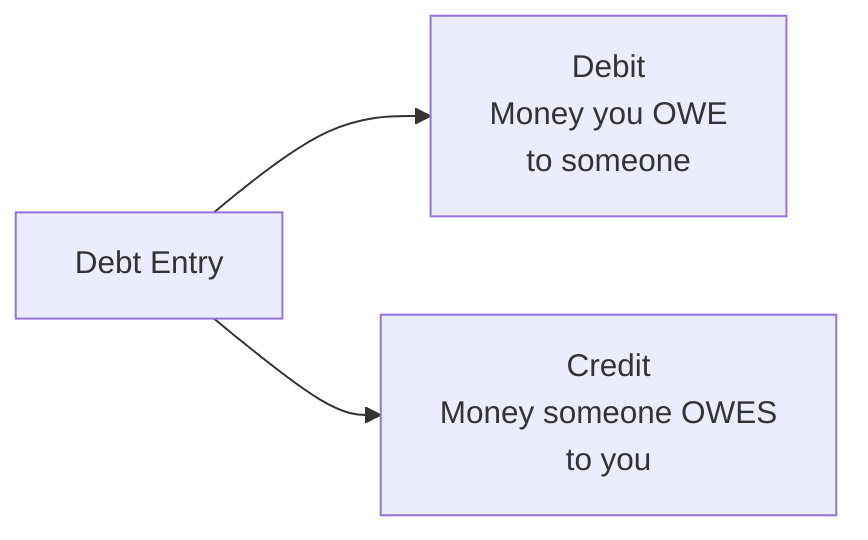
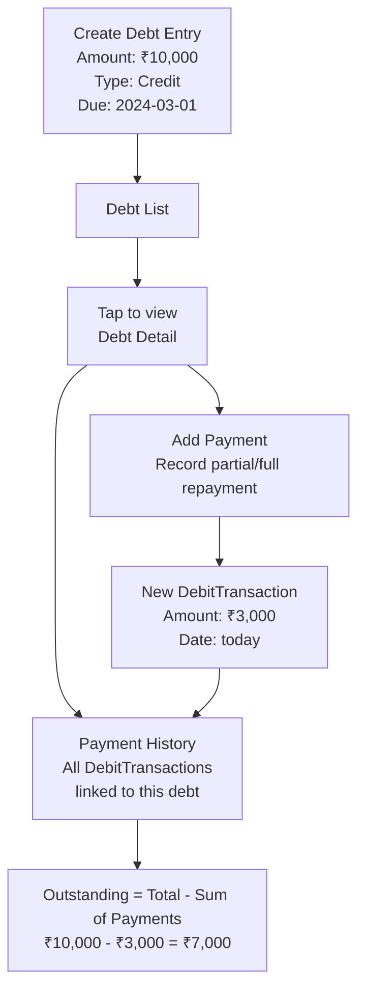

# Debts & Loans Feature

## Overview

The Debt feature helps users track money they've borrowed or lent to others. It supports adding individual payment records and shows outstanding balances.

**Files:** `lib/features/debit/` and `lib/features/debit_transaction/`

## Debt Types



| Type | Meaning | Example |
|------|---------|---------|
| `DebtType.debit` | You owe money | Borrowed ₹5,000 from friend |
| `DebtType.credit` | Someone owes you | Lent ₹2,000 to colleague |

## Data Models

### DebitModel (the debt itself)

```dart
class Debit {
  final String name;              // Description / who's involved
  final double amount;            // Total debt amount
  final DateTime dateTime;        // Date the debt was created
  final DateTime expiryDateTime;  // Due/repayment deadline
  final DebtType debtType;        // debit | credit
  final String? description;      // Optional notes
}
```

### DebitTransactionsModel (payments against the debt)

```dart
class DebitTransaction {
  final double amount;    // Payment amount
  final DateTime dateTime; // Payment date
  final int parentId;     // Links to DebitModel (Hive key)
}
```

## How it Works



## Cubit

`DebtsCubit` manages debt state:

| Method | Description |
|--------|-------------|
| `addDebt(Debit)` | Create a new debt entry |
| `deleteDebt(int id)` | Remove a debt |
| `updateDebt(Debit)` | Edit debt details |
| `addDebtTransaction(DebitTransaction)` | Record a payment |
| `deleteDebtTransaction(int id)` | Remove a payment record |
| `fetchDebts()` | Load all debts |

## Outstanding Balance

The outstanding amount is calculated at display time:

```
Outstanding = debt.amount - SUM(debitTransactions WHERE parentId = debt.key AND amount)
```

If outstanding ≤ 0, the debt is shown as fully settled.

## Expiry / Due Date

Each debt has an `expiryDateTime`. The UI:
- Shows how many days remain until the due date
- Highlights overdue debts in red
- Sorts debts with upcoming due dates first

## Route

- Debt form: `/landing/debit` (with optional `debtId` param for editing)
- Accessed from the main navigation under "Debts"

## Practical Use Cases

- Track a loan you took from family
- Remember you lent money to a friend
- Split restaurant bills and track who paid back
- Track EMIs or installment payments (as partial repayments)
