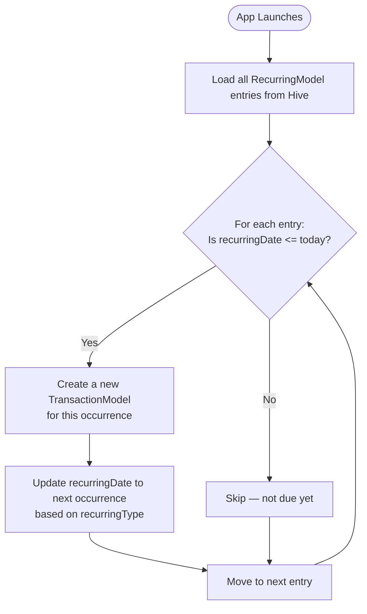

# Recurring Transactions Feature

## Overview

Recurring Transactions let you schedule automatic transaction entries at a fixed interval. This is perfect for salaries, subscriptions, rent, utility bills, or any predictable financial event.

**Files:** `lib/features/recurring/`

## Recurring Frequencies

| Type | Description | Example |
|------|-------------|---------|
| `daily` | Every day | Daily coffee budget |
| `weekly` | Every 7 days | Weekly grocery run |
| `monthly` | Every month (same date) | Salary, Netflix |
| `yearly` | Every year (same date) | Annual subscription, insurance |

## Data Model

```dart
class Recurring {
  final String name;                     // Label (e.g. "Netflix Subscription")
  final double amount;                   // Amount per occurrence
  final RecurringType recurringType;     // daily | weekly | monthly | yearly
  final DateTime recurringDate;          // Next scheduled date
  final int accountId;                   // Account to debit/credit
  final int categoryId;                  // Category for the transaction
  final TransactionType transactionType; // expense | income
}
```

## How Auto-Execution Works

When the app launches, the `RecurringCubit` (or repository) checks all recurring entries:



### Next Date Calculation

| Type | Next date formula |
|------|-----------------|
| daily | `recurringDate + 1 day` |
| weekly | `recurringDate + 7 days` |
| monthly | `recurringDate + 1 month` (same day of month) |
| yearly | `recurringDate + 1 year` (same day of year) |

## Cubit

`RecurringCubit` manages recurring state:

| Method | Description |
|--------|-------------|
| `addRecurring(Recurring)` | Schedule a new recurring entry |
| `deleteRecurring(int id)` | Remove a schedule |
| `updateRecurring(Recurring)` | Edit the schedule |
| `processRecurring()` | Check and execute overdue entries |

## Page

**Route:** `/landing/recurring`

The recurring list shows:
- Transaction name and amount
- Account and category
- Next scheduled date
- Frequency label
- Edit / Delete swipe actions

## Use Case Examples

| Use Case | Config |
|----------|--------|
| Monthly salary | Income, ₹50,000, Monthly, 1st of month |
| Netflix | Expense, ₹649, Monthly, 20th of month |
| Weekly groceries | Expense, ₹2,000, Weekly, every Monday |
| Annual domain renewal | Expense, ₹1,000, Yearly, registration date |

## Important Notes

::: warning Requires app launch
Recurring transactions only auto-execute when the app is opened. There is no background service. If the app hasn't been opened on the scheduled day, the transaction will be created on the next launch.
:::

If multiple scheduled dates have passed (e.g., app not opened for 3 months), all missed occurrences will be created in sequence on the next launch.
