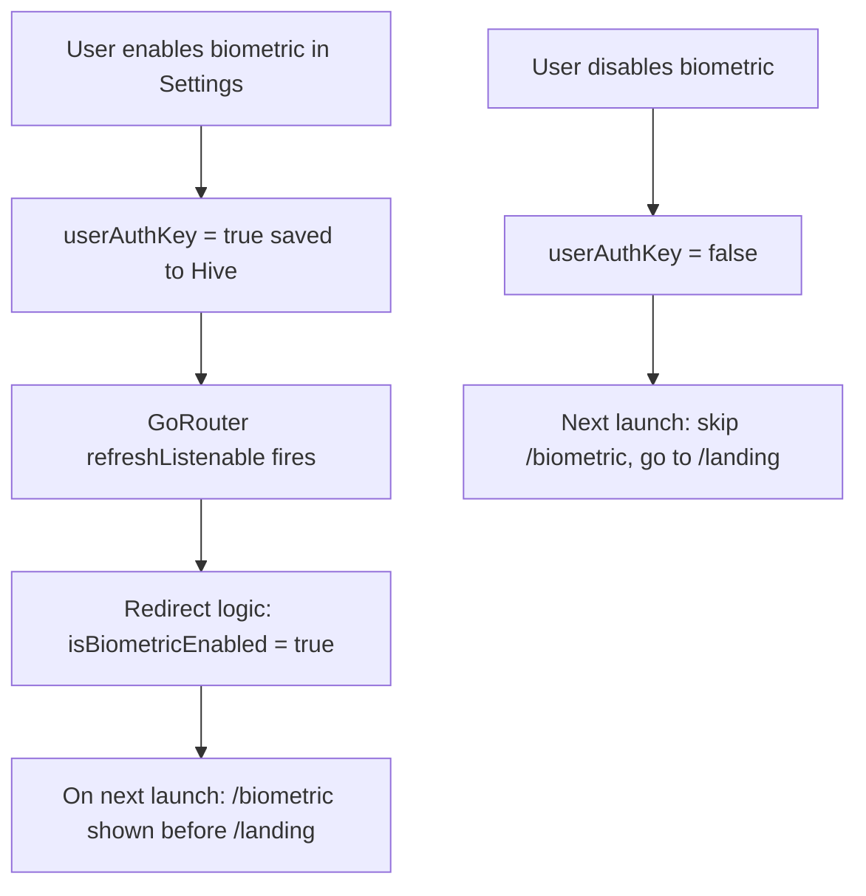

# Settings Feature

## Overview

The Settings feature gives users full control over the app's appearance, security, language, and data management.

**Files:** `lib/features/settings/`

## Settings Page (`/landing/settings`)

### Appearance

| Setting | Description | Stored Key |
|---------|-------------|-----------|
| Theme Mode | System / Light / Dark | `themeModeKey` |
| Dynamic Colors | Material You wallpaper colors (Android 12+) | `dynamicThemeKey` |
| Black Theme | Pure black dark mode (OLED-optimized) | `blackThemeKey` |
| Color | Custom primary seed color | `appColorKey` |
| Font | Font family from Google Fonts | `appFontChangerKey` |

### Language

- **Language Picker** (`/landing/settings/language-picker`)
- Available locales: English, German, Italian, Polish, Ukrainian, Vietnamese
- Changing language takes effect immediately without restart

### Security

| Setting | Description |
|---------|-------------|
| Biometric Authentication | Require fingerprint/face unlock on app open |

Toggle via `SettingCubit.toggleBiometric(bool)`.

### Data Management

| Action | Route | Description |
|--------|-------|-------------|
| Export & Import | `/landing/export` | Back up and restore data |

## SettingCubit

`SettingCubit` handles all settings changes:

```dart
@injectable
class SettingCubit extends Cubit<SettingState> {
  void updateThemeMode(ThemeMode mode);
  void toggleDynamicColors(bool enabled);
  void toggleBlackTheme(bool enabled);
  void updateColor(Color color);
  void updateFont(String fontFamily);
  void updateLanguage(Locale locale);
  void toggleBiometric(bool enabled);
}
```

Every method writes to the Hive `settings` box, then emits a new state. The `app.dart` root widget listens to these states and rebuilds the `MaterialApp` with the new theme/locale.

## Theme System

### Material 3 Color Scheme

Built with `flex_color_scheme`:

```dart
ThemeData lightTheme = FlexThemeData.light(
  scheme: FlexScheme.custom,
  colorScheme: ColorScheme.fromSeed(
    seedColor: userSelectedColor,
    brightness: Brightness.light,
  ),
  useMaterial3: true,
  fontFamily: userSelectedFont,
);
```

### Dynamic Colors (Material You)

On Android 12+, `dynamic_color` extracts colors from the wallpaper:

```dart
DynamicColorBuilder(
  builder: (lightDynamic, darkDynamic) {
    // Use wallpaper-derived colors if dynamic theme is enabled
    final scheme = isDynamicEnabled
        ? (isDark ? darkDynamic : lightDynamic)
        : null;
    return MaterialApp.router(colorScheme: scheme ?? defaultScheme);
  },
);
```

### Font Picker (`/landing/settings/font-picker`)

Shows a scrollable list of Google Fonts. Each font is previewed with the font applied. Selection is saved to `appFontChangerKey` and `GoogleFonts.getFont(fontName)` is applied to the theme.

## Biometric Authentication Flow



## Export & Import Page (`/landing/export`)

See [Export & Import User Flow](/user-flows/export-import) for the full walkthrough.

| Option | Format | Use |
|--------|--------|-----|
| Export JSON | `.json` | Full backup (all data) |
| Export CSV | `.csv` | Spreadsheet analysis |
| Import JSON | `.json` | Restore from backup |
