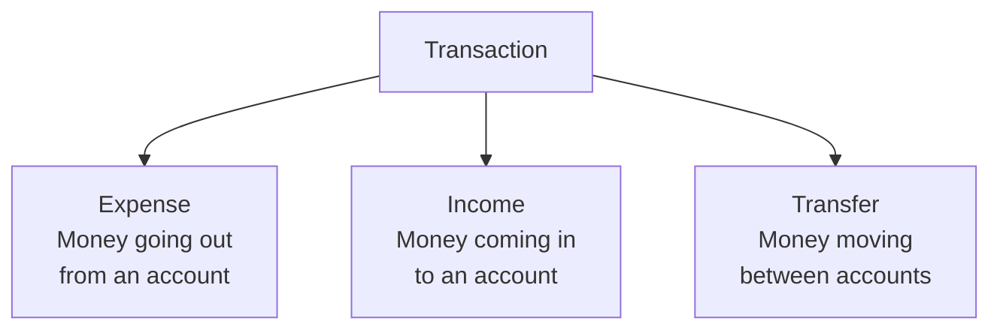

# Transactions Feature

## Overview

The Transaction feature is the core of Paisa. It handles creating, editing, deleting, and displaying all financial transactions.

**Files:** `lib/features/transaction/`

## Transaction Types



## Data Model

```dart
class Transaction {
  final int? superId;         // For transfers: target account ID
  final String name;          // Transaction label
  final double currency;      // Amount
  final int accountId;        // Source account (Hive key)
  final int categoryId;       // Category (Hive key)
  final DateTime time;        // When it occurred
  final TransactionType type; // expense | income | transfer
  final String? description;  // Optional notes
}
```

## BLoC

`TransactionBloc` handles all transaction operations:

| Event | Description |
|-------|-------------|
| `FetchTransactionFromIdEvent` | Load a single transaction for editing |
| `AddOrUpdateTransactionEvent` | Create or update a transaction |
| `DeleteTransactionEvent` | Remove a transaction |

| State | Description |
|-------|-------------|
| `TransactionInitial` | Default starting state |
| `TransactionLoading` | Processing an operation |
| `UpdateTransactionState` | Pre-populated data for editing |
| `TransactionAdded` | Transaction saved successfully |
| `TransactionDeleted` | Transaction removed successfully |
| `TransactionErrorState` | Error message from the operation |

## Use Cases

| Use Case | Input | Output |
|----------|-------|--------|
| `AddTransactionUseCase` | `Transaction` entity | `Either<AppError, void>` |
| `DeleteTransactionUseCase` | `int transactionId` | `Either<AppError, void>` |
| `GetTransactionByIdUseCase` | `int transactionId` | `Either<AppError, Transaction>` |
| `UpdateTransactionUseCase` | `Transaction` entity | `Either<AppError, void>` |
| `GetAllTransactionsUseCase` | — | `Either<AppError, List<Transaction>>` |

## Pages

### TransactionPage (`/landing/transaction`)

The add/edit form. Accepts optional query params:
- `transactionType` — pre-select Expense/Income/Transfer
- `accountId` — pre-select an account
- `categoryId` — pre-select a category
- `transactionId` — load existing transaction for editing

### Home Page Transaction List

Transactions are displayed on the home page, grouped by date. Each item shows:
- Category icon and color
- Transaction name
- Amount (colored red for expense, green for income)
- Date
- Account name

## Swipe Actions (flutter_slidable)

| Swipe Direction | Action |
|-----------------|--------|
| Swipe left → first action | Edit transaction |
| Swipe left → second action | Delete transaction |

## Transfer Handling

A transfer creates two linked `TransactionModel` entries:
1. **Expense** on the source account (`type = expense`)
2. **Income** on the destination account (`type = income`, `superId` = source account ID)

This ensures both account balances are accurately reflected.

## Filtering & Date Navigation

The home page includes a horizontal date timeline (via `date_picker_timeline`) that filters transactions by the selected day. The `SummaryController` aggregates the filtered totals.

## Related Features

- [Accounts](/features/accounts) — transactions are linked to accounts
- [Categories](/features/categories) — transactions are linked to categories
- [Recurring](/features/recurring) — auto-generates transactions on a schedule
- [Analytics](/features/analytics) — visualizes transaction data as charts
