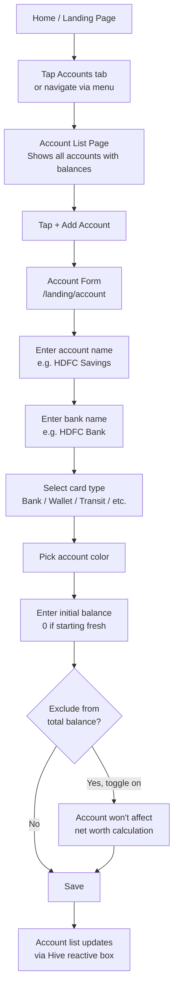

# Managing Accounts

## Account Management Flow

## Editing an Account

1. Open the account list
2. Tap the edit icon on any account row, or swipe to reveal edit option
3. Pre-populates the form with existing values
4. Save dispatches `AddOrUpdateAccountEvent` with the account's Hive key

## Account Detail View

Tapping an account opens a detail page showing:
- Account name, bank, and card type
- Current balance (initial amount ± all transactions)
- Full transaction history for that account
- Charts for income vs. expense on that account

## Card Types

| Type | Description |
|------|-------------|
| Bank | Traditional bank account (savings, current) |
| Wallet | Digital wallets (PayTM, Google Pay, etc.) |
| Transit | Transit cards, prepaid cards |
| Credit | Credit cards |
| Cash | Physical cash |

## Account Exclusion

When `isAccountExcluded = true`, the account's balance is excluded from:
- Total net worth on the home dashboard
- The summary balance calculation

This is useful for tracking a credit card separately — you don't want the credit limit showing as your wealth.

## Delete an Account

::: warning
Deleting an account also deletes all transactions linked to that account. This action cannot be undone.
:::

Swipe left on any account list item → tap Delete.

## Transfers Between Accounts

When you create a Transfer transaction:
1. The amount is deducted from the **source** account
2. The amount is added to the **destination** account
3. Both transactions share a `superId` linking them

This keeps both account balances accurate.
