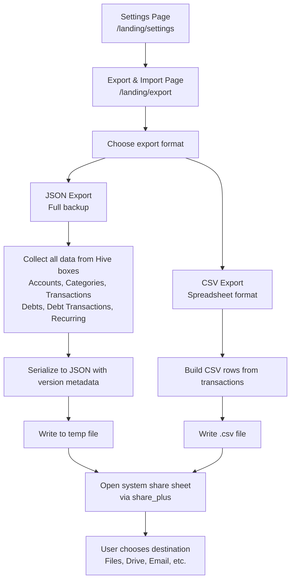
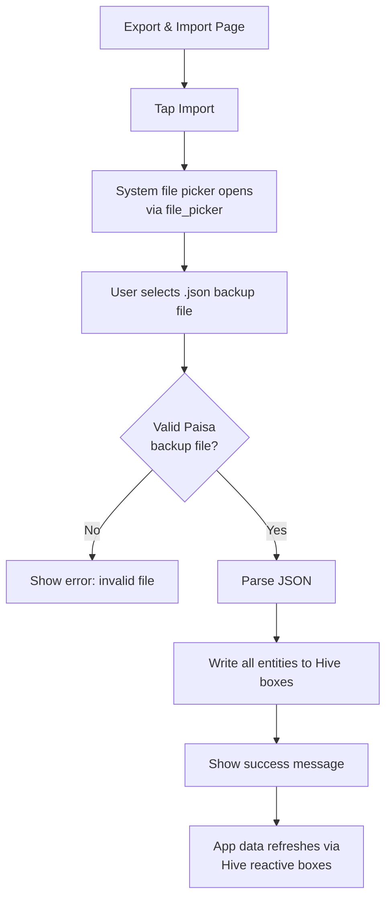

# Export & Import Data

## Overview

Paisa provides full data portability. You can back up all your data and restore it at any time. This is the only form of "sync" available — the app is fully offline, so you manage your own backups.

## Export Flow



## Import Flow



## JSON Backup File Structure

```json
{
  "version": "6.0.8",
  "created_at": "2024-01-15T10:30:00.000Z",
  "accounts": [
    {
      "name": "HDFC Savings",
      "bankName": "HDFC Bank",
      "amount": 50000.0,
      "color": -14575885,
      "cardType": 0,
      "isAccountExcluded": false
    }
  ],
  "categories": [
    {
      "name": "Food",
      "icon": 983237,
      "color": -43230,
      "isDefault": true,
      "isBudget": false,
      "budget": null
    }
  ],
  "transactions": [
    {
      "name": "Lunch at restaurant",
      "currency": 350.0,
      "accountId": 0,
      "categoryId": 1,
      "time": "2024-01-15T13:00:00.000Z",
      "type": 0,
      "description": "Team lunch"
    }
  ],
  "debts": [],
  "debtTransactions": [],
  "recurring": []
}
```

## CSV Export Columns

| Column | Description |
|--------|-------------|
| Date | Transaction date in ISO 8601 format |
| Name | Transaction label |
| Amount | Transaction amount |
| Account | Account name |
| Category | Category name |
| Type | `Expense`, `Income`, or `Transfer` |
| Description | Optional notes |

## Tips for Backup Management

- **Regular backups**: Export to Google Drive or iCloud weekly
- **Before updates**: Always export before updating the app
- **Migration**: Use JSON export to migrate data to a new device
- **Spreadsheet analysis**: Use CSV export to analyze data in Excel / Google Sheets

## Limitations

- Import **replaces or merges** existing data — there is no conflict resolution
- The backup file includes all data — partial restores are not supported
- CSV import is not supported in v6.0.8 (JSON only for import)
