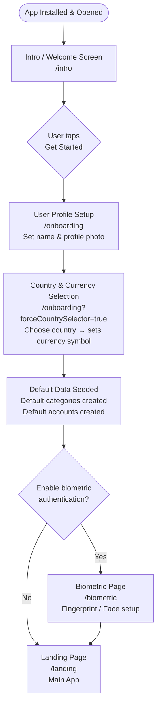

# Onboarding Flow

When a user installs and opens Paisa for the first time, they are guided through a multi-step onboarding experience before reaching the main app.

## Full Onboarding Sequence



## Step 1: Intro / Welcome Screen (`/intro`)

**File:** `lib/features/intro/presentation/pages/intro_page.dart`

- Displays the Paisa logo and app name
- Shows a brief value proposition
- Single "Get Started" button
- **On completion:** Sets `userIntroFinishedKey = true` in Hive → router auto-redirects to `/onboarding`

## Step 2: User Profile Setup (`/onboarding`)

**File:** `lib/features/intro/presentation/pages/user_onboarding_page.dart`

The onboarding page is a multi-step form:

### Step 2a: Name Entry
- Text field for the user's display name
- Saved to `userNameSetKey` in settings box

### Step 2b: Profile Photo
- Option to pick from gallery or take a photo (via `image_picker`)
- Photo path saved to `userImageKey` in settings box

### Step 2c: Country & Currency Selection
- `CountryPickerCubit` loads a list of countries from a local JSON asset
- User searches and selects their country
- Selection saved as JSON to `userCountryKey` — this determines the currency symbol used throughout the app
- If `forceCountrySelector=true` query param is present, skips to this step directly

## Step 3: Default Data Seeding

When the user completes the profile, the app seeds:

- **Default Categories**: Food, Transport, Shopping, Entertainment, Health, Education, Salary, etc.
- **Default Accounts**: A sample "Wallet" account to get started

These are created only once and tracked by `userCategorySelectorKey` and `userAccountSelectorKey`.

## Step 4: Biometric Setup (Optional) (`/biometric`)

**File:** `lib/features/intro/presentation/pages/biometric_page.dart`

- User is offered the option to protect the app with biometrics
- Uses `local_auth` to check device capability
- If the device supports fingerprint/face auth, the user can enable it
- Setting saved to `userAuthKey`

## Step 5: Landing Page (`/landing`)

The main app shell. Once here, the user has full access to all features.

## Returning User Flow

For users who have already completed onboarding:

```mermaid
flowchart TD
    OPEN([App Opened]) --> CHECK{Biometric\nenabled?}
    CHECK -- Yes --> BIO[/biometric\nAuthenticate to unlock]
    CHECK -- No --> LANDING[/landing\nMain App]
    BIO -- Authenticated --> LANDING
    BIO -- Failed --> RETRY[Retry / Cancel]
```

## Onboarding State Keys

| Hive Key | Type | Set When |
|----------|------|----------|
| `userIntroFinishedKey` | `bool` | Intro screen completed |
| `userNameSetKey` | `String` | Name entered |
| `userImageKey` | `String` | Photo selected |
| `userCategorySelectorKey` | `bool` | Default categories seeded |
| `userAccountSelectorKey` | `bool` | Default account seeded |
| `userCountryKey` | `Map` | Country selected |
| `userAuthKey` | `bool` | Biometric enabled/disabled |
