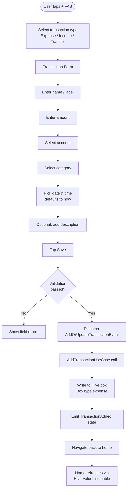
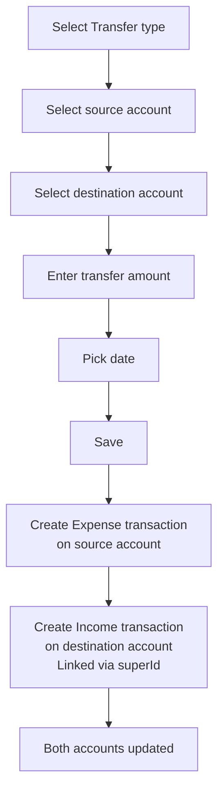
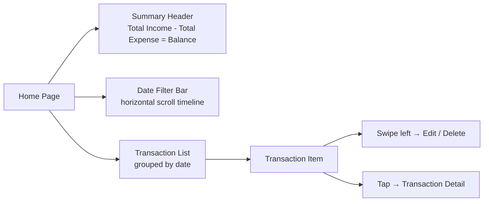

# Adding & Managing Transactions

## Adding a New Transaction

### Entry Points

There are three ways to open the transaction form:

1. **FAB on Home Screen** — Floating action button on the landing page
2. **Quick Action shortcut** — Home screen long-press shortcut (Android/iOS) for Expense, Income, or Transfer
3. **Deep link** — `/landing/transaction?type=0` (0=expense, 1=income, 2=transfer)

### Add Expense Flow

### Add Transfer Flow

Transfers move money between two accounts. They create a pair of linked transactions:

## Editing a Transaction

1. In the transaction list, **swipe left** to reveal Edit action (via `flutter_slidable`)
2. Or **tap** a transaction to open detail view, then tap the edit icon
3. Pre-populates the form with existing values
4. Save dispatches `AddOrUpdateTransactionEvent` with `transactionId` set (triggers update path)

## Deleting a Transaction

- **Swipe left** on any transaction list item to reveal the Delete action
- Dispatches `DeleteTransactionEvent` with the transaction's Hive key
- Hive entry is removed; home page automatically refreshes

## Filtering Transactions

On the Home page, transactions can be filtered by:

- **Date range**: Day / Week / Month / Year / Custom
- **Account**: Show only transactions for a specific account
- **Category**: Drill-down from the Overview chart
- **Transaction type**: Expense / Income / All

## Transaction List on Home

## Transaction Form Validation Rules

| Field | Validation |
|-------|-----------|
| Name | Required, non-empty |
| Amount | Required, must be > 0 |
| Account | Required, must select an account |
| Category | Required (not needed for transfers) |
| Date | Required, defaults to current time |
| Source + Target Account | For transfers: must be different accounts |
